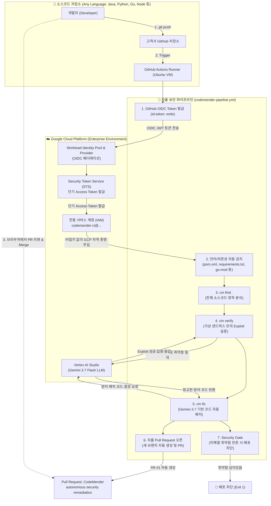
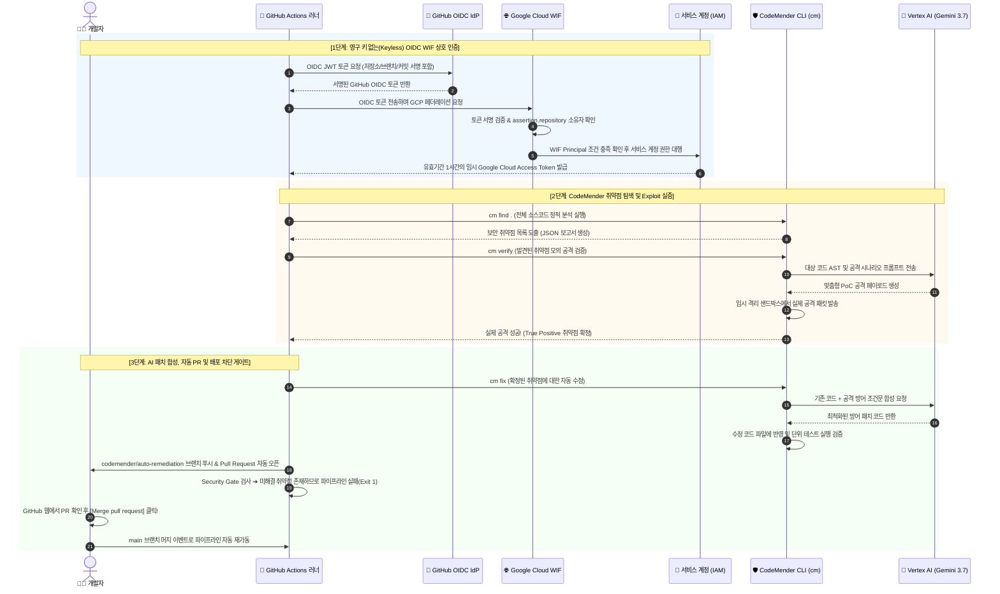

# 🛡️ Enterprise Autonomous DevSecOps Engine: CodeMender & Google Cloud WIF
> **어떤 프로그래밍 언어(Java, Python, Go, Node.js, C++ 등)든 3분 만에 적용 가능한 Keyless(WIF) 자율 AI 보안 파이프라인 엔진**

---

## 📑 목차 (Table of Contents)
1. [솔루션 개요: 왜 CodeMender DevSecOps 엔진인가?](#1-솔루션-개요-왜-codemender-devsecops-엔진인가)
2. [전체 엔드투엔드 시스템 아키텍처](#2-전체-엔드투엔드-시스템-아키텍처)
3. [보안 인증 및 AI 자율 조치 시퀀스 흐름도](#3-보안-인증-및-ai-자율-조치-시퀀스-흐름도)
4. [언어 독립적(Language-Agnostic) 지원 아키텍처](#4-언어-독립적language-agnostic-지원-아키텍처)
5. [사전 준비 사항 (Prerequisites)](#5-사전-준비-사항-prerequisites)
6. [상세 엔터프라이즈 구축 가이드 (Step-by-Step)](#6-상세-엔터프라이즈-구축-가이드-step-by-step)
   - [Step 1: Google Cloud 환경 설정 및 필수 API 활성화](#step-1-google-cloud-환경-설정-및-필수-api-활성화)
   - [Step 2: Keyless 인증을 위한 Workload Identity Federation (WIF) 구성](#step-2-keyless-인증을-위한-workload-identity-federation-wif-구성)
   - [Step 3: 전용 서비스 계정(IAM) 생성 및 Vertex AI 권한 부여](#step-3-전용-서비스-계정iam-생성-및-vertex-ai-권한-부여)
   - [Step 4: GitHub 저장소 설정 (Actions 권한 및 Repository Variables)](#step-4-github-저장소-설정-actions-권한-및-repository-variables)
   - [Step 5: 기존 프로젝트에 파이프라인 이식 (Plug-and-Play)](#step-5-기존-프로젝트에-파이프라인-이식-plug-and-play)
   - [Step 6: 자율 보안 파이프라인 가동 및 AI 자동 패치 PR 체험](#step-6-자율-보안-파이프라인-가동-및-ai-자동-패치-pr-체험)
7. [문제 해결 및 트러블슈팅 (FAQ)](#7-문제-해결-및-트러블슈팅-faq)
8. [부록: 온프레미스/엔터프라이즈 환경을 위한 Jenkins(젠킨스) 연동 가이드](#8-부록-온프레미스엔터프라이즈-환경을-위한-jenkins젠킨스-연동-가이드)

---

## 1. 솔루션 개요: 왜 CodeMender DevSecOps 엔진인가?

전통적인 소프트웨어 보안 스캐너(SAST)와 CI/CD 보안 검사는 기업 개발 생산성에 큰 병목을 초래합니다:

| 기존의 한계점 | 기존 환경의 구체적인 문제점 | CodeMender & WIF 엔진의 해결책 |
| :--- | :--- | :--- |
| **영구 서비스 계정 키 유출**<br>(Credential Leak) | GitHub Secrets에 저장된 `JSON Service Account Key` 탈취로 인한 인프라 장악 사고 빈번. | **Keyless WIF (Workload Identity Federation)**<br>저장된 키가 전혀 없으며, GitHub OIDC 토큰과 GCP STS를 통해 단기(Short-lived) 토큰으로 맞교환하여 인증. |
| **정적 분석기(SAST)의 오탐 지옥**<br>(False Positive Fatigue) | 실제 뚫리지도 않는 의심 코드를 수백 개씩 경고하여 개발자가 보안 경고 자체를 무시하게 됨. | **Exploit 모의 공격 검증 (`cm verify`)**<br>격리된 샌드박스에서 실제 해킹 페이로드를 실행해 진짜 뚫리는 취약점(True Positive)만 필터링. |
| **수동 패치 병목**<br>(Remediation Bottleneck) | 취약점이 발견되어도 보안팀-개발팀 간 핑퐁으로 인해 실제 패치까지 수일~수주일이 소요됨. | **AI 자율 패치 및 PR 자동 생성 (`cm fix`)**<br>Google Cloud Vertex AI(Gemini 3.7 Flash)가 방어 코드를 스스로 작성하고 단위 테스트 통과 후 **GitHub Pull Request를 자율 생성**. |
| **언어/프레임워크 종속성**<br>(Language Lock-in) | 특정 언어 전용 스캐너는 다국어 마이크로서비스 환경에서 파이프라인 관리가 파편화됨. | **범용 다국어 자동 감지 아키텍처**<br>Java, Python, Go, Node.js, C++ 등 저장소의 매니페스트를 자동 감지하여 범용 스캔 지원. |

---

## 2. 전체 엔드투엔드 시스템 아키텍처



---

## 3. 보안 인증 및 AI 자율 조치 시퀀스 흐름도



---

## 4. 언어 독립적(Language-Agnostic) 지원 아키텍처

본 엔진은 특정 프로그래밍 언어나 프레임워크에 종속되지 않습니다. 파이프라인이 레포지토리의 매니페스트 파일을 자동으로 감지하여 빌드 환경을 구성합니다:

| 프로그래밍 언어 | 자동 감지 파일 (Manifest) | 사전 의존성 준비 동작 | 지원 기능 |
| :--- | :--- | :--- | :---: |
| **Java** | `pom.xml`, `build.gradle`, `build.gradle.kts` | `mvn dependency:resolve` / `gradle dependencies` | 탐지, 모의 공격, 자동 패치 |
| **Python** | `requirements.txt`, `Pipfile`, `pyproject.toml` | `pip install -r requirements.txt` | 탐지, 모의 공격, 자동 패치 |
| **Go** | `go.mod`, `go.sum` | `go mod download` | 탐지, 모의 공격, 자동 패치 |
| **Node.js** | `package.json`, `package-lock.json` | `npm install --no-audit` | 탐지, 모의 공격, 자동 패치 |
| **C / C++** | `CMakeLists.txt`, `Makefile` | 표준 빌드 툴체인 사용 | 소스코드 정적 스캔 및 패치 |

---

## 5. 사전 준비 사항 (Prerequisites)

1. **Google Cloud 계정**: 활성화된 GCP 프로젝트 (Project Owner 또는 IAM/Vertex AI 수정 권한 필요).
2. **GitHub 계정**: 퍼블릭 또는 프라이빗 리포지토리를 보유한 계정.
3. **로컬 개발 도구**:
   - `git` (2.x 이상)
   - `gcloud` CLI (설치 및 로그인 완료 상태)

---

## 6. 상세 엔터프라이즈 구축 가이드 (Step-by-Step)

### Step 1: Google Cloud 환경 설정 및 필수 API 활성화
터미널(또는 Cloud Shell)을 열고 사용할 Google Cloud 프로젝트를 설정한 후 필수 5대 API를 활성화합니다.

```bash
# 1. 사용할 Google Cloud 프로젝트 ID 지정 (본인의 프로젝트 ID 입력)
export PROJECT_ID="YOUR_GCP_PROJECT_ID"
gcloud config set project $PROJECT_ID

# 2. 프로젝트 번호(Project Number) 확인 및 환경변수 저장
export PROJECT_NUM=$(gcloud projects describe $PROJECT_ID --format='value(projectNumber)')
echo "Project ID: $PROJECT_ID | Project Number: $PROJECT_NUM"

# 3. 필수 API 활성화
gcloud services enable \
  iam.googleapis.com \
  iamcredentials.googleapis.com \
  cloudresourcemanager.googleapis.com \
  aiplatform.googleapis.com \
  serviceusage.googleapis.com
```

---

### Step 2: Keyless 인증을 위한 Workload Identity Federation (WIF) 구성
GitHub Actions 러너가 비밀 키 없이 인증할 수 있도록 WIF Pool과 Provider를 생성합니다.

```bash
# 1. Workload Identity Pool 생성
gcloud iam workload-identity-pools create "github-actions" \
  --project="${PROJECT_ID}" \
  --location="global" \
  --display-name="GitHub Actions Pool"

# 2. OIDC Provider 생성 (본인의 GitHub 사용자명 또는 Organization 이름 지정)
export GITHUB_OWNER="YOUR_GITHUB_USERNAME_OR_ORG"

gcloud iam workload-identity-pools providers create-oidc "github-oidc" \
  --project="${PROJECT_ID}" \
  --location="global" \
  --workload-identity-pool="github-actions" \
  --display-name="GitHub Actions OIDC Provider" \
  --issuer-uri="https://token.actions.githubusercontent.com" \
  --attribute-mapping="google.subject=assertion.sub,attribute.repository=assertion.repository" \
  --attribute-condition="assertion.repository_owner == '${GITHUB_OWNER}'"
```

---

### Step 3: 전용 서비스 계정(IAM) 생성 및 Vertex AI 권한 부여
CodeMender 러너가 Gemini 모델(`Vertex AI`)을 호출할 수 있는 권한을 서비스 계정에 부여하고, WIF와 연결합니다.

```bash
# 1. 서비스 계정 생성
gcloud iam service-accounts create "codemender-ci" \
  --project="${PROJECT_ID}" \
  --display-name="CodeMender CI Service Account"

export SA_EMAIL="codemender-ci@${PROJECT_ID}.iam.gserviceaccount.com"

# 2. 필수 IAM 권한 부여
gcloud projects add-iam-policy-binding "${PROJECT_ID}" \
  --member="serviceAccount:${SA_EMAIL}" \
  --role="roles/serviceusage.serviceUsageConsumer"

gcloud projects add-iam-policy-binding "${PROJECT_ID}" \
  --member="serviceAccount:${SA_EMAIL}" \
  --role="roles/aiplatform.admin"

# 3. WIF Provider와 서비스 계정 바인딩
# ⚠️ 대상 저장소 이름(REPO_NAME)을 지정하세요
export REPO_NAME="YOUR_TARGET_REPOSITORY_NAME"

gcloud iam service-accounts add-iam-policy-binding "${SA_EMAIL}" \
  --project="${PROJECT_ID}" \
  --role="roles/iam.workloadIdentityUser" \
  --member="principalSet://iam.googleapis.com/projects/${PROJECT_NUM}/locations/global/workloadIdentityPools/github-actions/attribute.repository/${GITHUB_OWNER}/${REPO_NAME}"
```

---

### Step 4: GitHub 저장소 설정 (Actions 권한 및 Repository Variables)

#### 1) GitHub Actions Workflow 쓰기 권한 활성화
GitHub 웹 브라우저에서 대상 저장소의 설정으로 이동합니다:
1. **Settings > Actions > General > Workflow permissions**
2. [x] **Read and write permissions** 선택
3. [x] **Allow GitHub Actions to create and approve pull requests** 체크 후 저장

#### 2) Repository Variables 등록
**Settings > Secrets and variables > Actions > Variables** (Secrets 아님) 탭에서 아래 3개를 등록합니다:

| Variable 이름 | 설정 값 | 설명 |
| :--- | :--- | :--- |
| `GCP_WIF_PROVIDER` | `projects/<PROJECT_NUM>/locations/global/workloadIdentityPools/github-actions/providers/github-oidc` | Step 2의 WIF Provider 전체 리소스 경로 |
| `GCP_SA_EMAIL` | `codemender-ci@<PROJECT_ID>.iam.gserviceaccount.com` | Step 3의 서비스 계정 이메일 |
| `GCP_QUOTA_PROJECT` | `<PROJECT_ID>` | 할당량을 청구할 Google Cloud 프로젝트 ID |

---

### Step 5: 기존 프로젝트에 파이프라인 이식 (Plug-and-Play)

어떤 언어로 작성된 프로젝트이든, 본 저장소의 엔진과 파이프라인을 복사해 넣으면 즉시 자율 보안이 적용됩니다.

```bash
# 고객사 프로젝트 루트 디렉토리에서 실행:

# 1. CodeMender 바이너리 복사
mkdir -p lab/bin
cp /path/to/codemender-security-lab/lab/bin/cm-linux lab/bin/cm-linux
chmod +x lab/bin/cm-linux

# 2. 범용 파이프라인 지시서 복사
mkdir -p .github/workflows
cp /path/to/codemender-security-lab/lab/solutions/codemender-pipeline.solution.yaml .github/workflows/codemender-pipeline.yml

# 3. Git 커밋 및 푸시
git add lab/bin/cm-linux .github/workflows/codemender-pipeline.yml
git commit -m "ci: add generic CodeMender autonomous security pipeline"
git push origin main
```

---

### Step 6: 자율 보안 파이프라인 가동 및 AI 자동 패치 PR 체험

1. **GitHub Actions 탭 확인**: 푸시 즉시 파이프라인이 실행되며 WIF 토큰을 교환하고, 소스코드 전체를 정밀 스캔합니다.
2. **자율 Pull Request 리뷰**:
   - 취약점이 발견되면 Gemini 모델이 공격 벡터를 검증하고, 최적의 방어 코드를 작성하여 **신규 브랜치 및 Pull Request를 자율적으로 생성**합니다.
   - 개발자는 PR의 `Files changed` 탭에서 AI가 제안한 패치 코드를 편안하게 리뷰합니다.
3. **Security Gate 배포 차단**:
   - 패치되지 않은 취약점이 남아있을 경우 파이프라인은 `Security Gate` 단계에서 빌드를 중단(`exit 1`)시켜 취약한 코드가 운영 서버로 배포되는 것을 철저히 차단합니다.
4. **Merge 및 재검증**:
   - PR을 머지하면 파이프라인이 다시 실행되어 취약점이 해결되었음을 확인하는 완전한 선순환 수명주기를 완성합니다.

---

## 7. 문제 해결 및 트러블슈팅 (FAQ)

### Q1. WIF 인증 단계에서 `403 Forbidden` 또는 `Subject token invalid` 에러가 발생합니다.
- **원인**: WIF Provider의 `attribute-condition`과 푸시한 GitHub 저장소의 소유자/조직명이 일치하지 않을 때 발생합니다.
- **해결책**:
  ```bash
  gcloud iam workload-identity-pools providers describe "github-oidc" \
    --project="${PROJECT_ID}" \
    --location="global" \
    --workload-identity-pool="github-actions" \
    --format="value(attributeCondition)"
  ```
  위 조건이 실제 저장소 경로(`assertion.repository_owner == 'your-owner'`)와 일치하는지 확인하세요.

### Q2. `cm verify` 또는 `cm fix` 단계에서 `aiplatform.endpoints.predict` 권한 부족 에러가 납니다.
- **원인**: 서비스 계정에 부여된 Vertex AI 권한이 부족하여 Gemini 3.7 모델 엔드포인트와 통신하지 못한 경우입니다.
- **해결책**: 서비스 계정에 `roles/aiplatform.admin` 권한을 부여하세요.
  ```bash
  gcloud projects add-iam-policy-binding "${PROJECT_ID}" \
    --member="serviceAccount:${SA_EMAIL}" \
    --role="roles/aiplatform.admin"
  ```

### Q3. 파이프라인에서 `gh pr create` 단계가 권한 오류(`Resource not accessible by integration`)로 실패합니다.
- **원인**: GitHub 저장소의 Actions Workflow 권한이 `Read-only`로 제한되어 있어 PR을 생성하지 못한 경우입니다.
- **해결책**: Step 4의 설정에서 **Read and write permissions** 및 **Allow GitHub Actions to create and approve pull requests**를 반드시 활성화하세요.

---

## 8. 부록: 온프레미스/엔터프라이즈 환경을 위한 Jenkins(젠킨스) 연동 가이드

사내 자체 구축형 CI/CD 도구인 **Jenkins(젠킨스)**를 사용하는 기업에서도 동일한 원리로 파이프라인을 구축할 수 있습니다.

### 🔄 GitHub Actions vs Jenkins 매핑

| 구현 기능 | GitHub Actions | Jenkins (엔터프라이즈) |
| :--- | :--- | :--- |
| **파이프라인 지시서** | `.github/workflows/codemender-pipeline.yml` (YAML) | **`Jenkinsfile`** (Groovy Pipeline as Code) |
| **자동 실행 트리거** | `on: push` | **GitHub Webhook** (`githubPush()` 트리거) |
| **실행 인프라** | GitHub 호스팅 클라우드 러너 (`ubuntu-latest`) | 사내 Jenkins 에이전트 노드 또는 K8s 파드 |
| **Keyless GCP 인증** | `google-github-actions/auth@v2` (WIF OIDC) | **`GCP WIF for Jenkins`** OIDC 자격증명 파일 주입 |
| **CLI 도구 구동** | `lab/bin/cm-linux` 직접 호출 | 젠킨스 도커 컨테이너 내부에서 `cm-linux` 실행 |
| **자율 PR 발행** | GitHub REST API / `gh` CLI | `gh` CLI 또는 Jenkins GitHub Branch Source 플러그인 |

### 📝 엔터프라이즈용 Jenkinsfile 예시

```groovy
pipeline {
    agent {
        docker {
            image 'google/cloud-sdk:latest'
            args '-u root:root'
        }
    }

    environment {
        PROJECT_ID    = credentials('gcp-project-id')
        SA_EMAIL      = credentials('codemender-sa-email')
        WIF_PROVIDER  = credentials('gcp-wif-provider')
        CM_MODEL      = 'gemini-3.7-flash'
        SCAN_PATH     = '.'
    }

    triggers {
        githubPush()
    }

    stages {
        stage('Checkout Source') {
            steps {
                checkout scm
            }
        }

        stage('GCP WIF Authentication') {
            steps {
                echo '🔑 Jenkins OIDC Token을 구글 클라우드 WIF와 교환하여 인증'
                sh '''
                    export GOOGLE_APPLICATION_CREDENTIALS="/tmp/gcp-wif-creds.json"
                '''
            }
        }

        stage('CodeMender Scan & Remediate') {
            steps {
                echo '🔍 CodeMender 정적 분석, 가상 모의 공격 검증 및 자동 패치'
                sh '''
                    chmod +x lab/bin/cm-linux
                    export PATH="$(pwd)/lab/bin:$PATH"
                    cm find "${SCAN_PATH}" -y --model "${CM_MODEL}"
                '''
            }
        }

        stage('Security Gate') {
            steps {
                echo '🚪 엔터프라이즈 보안 게이트 검사'
                script {
                    // 미해결 HIGH/CRITICAL 취약점 존재 시 배포 차단
                }
            }
        }
    }

    post {
        always {
            archiveArtifacts artifacts: 'target/*.html, target/*.json', allowEmptyArchive: true
        }
    }
}
```
