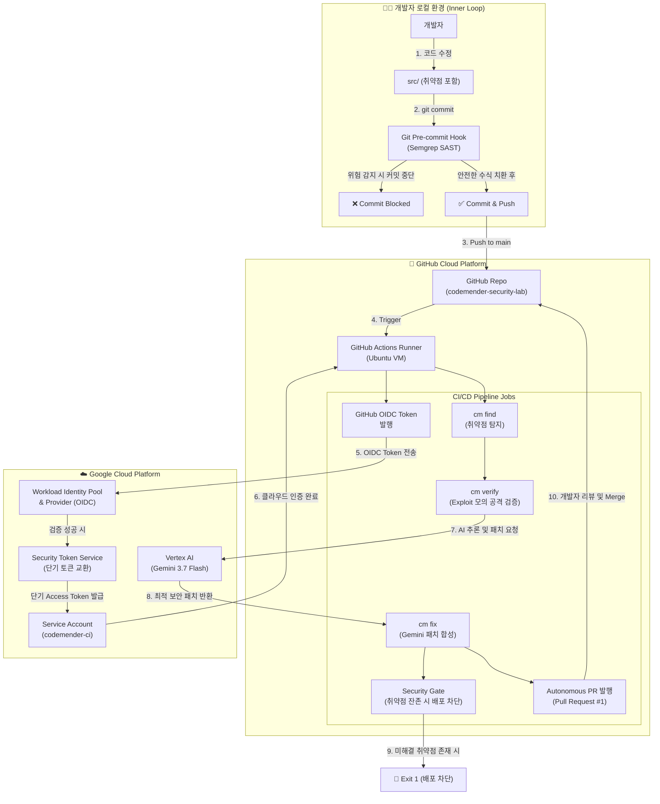
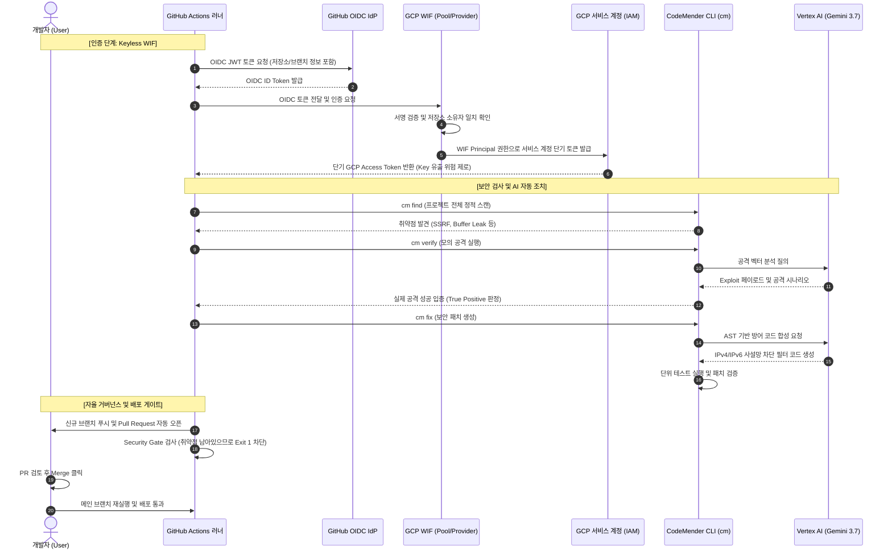

# 🛡️ Enterprise Autonomous DevSecOps Hands-on Lab
### Google Cloud Workload Identity Federation (WIF) & CodeMender AI Agent

---

## 📖 1. 랩 개요 및 배경 (Background & Objective)

### 💡 왜 이 실습이 필요한가요? (배경)
전통적인 개발 및 배포 환경에서는 보안 검사가 릴리즈 직전에 수동으로 이루어지거나, CI/CD 파이프라인에서 취약점 스캐너(SAST)가 수백 개의 경고를 쏟아내며 개발자에게 일일이 고치라고 떠넘기는 방식이었습니다. 이로 인해:
1. **오탐(False Positive) 피로도**: 실제로 악용 불가능한 취약점까지 경고되어 개발자가 무시함.
2. **배포 지연 및 병목**: 취약점을 사람이 분석하고 패치 코드를 작성하느라 며칠씩 지연됨.
3. **보안 키 유출 위험**: CI/CD 파이프라인(GitHub Actions)에 Google Cloud의 영구 서비스 계정 키(`JSON Key`)를 등록해 두었다가 GitHub이 털리거나 실수로 커밋되어 클라우드 계정이 탈취되는 사고 빈번.

### 🎯 이 랩의 목표 (What You Will Build)
본 랩에서는 Google Cloud의 최신 보안 및 AI 기술을 결합하여 **현대적인 자율 보안(Autonomous DevSecOps) 파이프라인**을 구축합니다:
- **Keyless Architecture (WIF)**: 영구적인 JSON 비밀 키를 100% 제거하고, GitHub이 발행한 OIDC 토큰과 Google Cloud STS를 통한 단기(Short-lived) 토큰 교환으로 클라우드에 안전하게 접근합니다.
- **Shift-Left Local Security (Inner Loop)**: 코드를 커밋하기 전 로컬 환경에서 Git Pre-commit Hook과 Semgrep으로 위험한 코드를 사전에 차단합니다.
- **Autonomous Remediation (CodeMender + Gemini 3.7 Flash)**:
  - 취약점 단순 탐지(`cm find`)에 그치지 않고,
  - 가상 샌드박스에서 모의 해킹 페이로드를 실행해 실제 뚫리는지 공격 검증(`cm verify`)을 거쳐 오탐을 0%로 만들고,
  - Gemini LLM 에이전트가 완벽한 방어 패치 코드를 스스로 작성(`cm fix`)하여,
  - 개발자가 검토만 하면 되도록 **GitHub Pull Request(PR)**를 자동으로 발행합니다.
- **Strict Security Gate**: 패치되지 않은 취약점이 남아있는 한 메인 브랜치의 배포를 원천 차단하는 엔터프라이즈 거버넌스를 구현합니다.

---

## 🏗️ 2. 아키텍처 및 엔드투엔드 워크플로우 (Architecture & Flow)

### 📊 전체 시스템 아키텍처 다이어그램



---

## 🔄 3. 단계별 핵심 메커니즘 상세 설명



---

## 📋 4. 디렉토리 구조 및 각 구성요소 역할

```text
codemender-security-lab/
├── README.md                      # [현재 파일] 전체 아키텍처 및 상세 실습 매뉴얼
├── package.json                   # 취약점 테스트용 Node.js 웹 애플리케이션 명세
├── src/                           # 🚨 취약점 분석 대상 소스코드 (Express 백엔드)
│   ├── README.md                  # 5대 취약점 상세 기술 분석 및 로컬 수정 가이드
│   ├── app.js / server.js         # 웹 애플리케이션 진입점
│   ├── api/controllers/           # [RCE 취약점] admin.controller.js (eval 사용)
│   └── services/                  # [SSRF 취약점] catalog.service.js 등 취약 서비스들
├── lab/                           # 🛠️ 실습 도구, 스크립트 및 솔루션
│   ├── README.md                  # CLI 도구 사용법 및 힌트 모음
│   ├── bin/cm-linux               # CodeMender 오프라인 CLI 실행 파일
│   ├── hooks/                     # Git Pre-commit 훅 설치 스크립트 (install.sh)
│   ├── scripts/                   # Semgrep 출력 결과를 cm 포맷으로 변환하는 브릿지
│   ├── templates/                 # 실습자가 완성해야 하는 파이프라인 미완성 템플릿
│   └── solutions/                 # 정답 파이프라인 (codemender-pipeline.solution.yaml)
└── .github/                       # 🤖 GitHub CI/CD 파이프라인 설정
    ├── README.md                  # Workflow 환경변수 및 권한 세팅 가이드
    ├── scripts/                   # PR 발행, 패치 추출 등 파이프라인 보조 스크립트
    └── workflows/                 # 실습자가 템플릿을 완성하여 배치할 위치
```

---

## 🚀 5. 단계별 핸즈온 가이드 (Step-by-Step Execution)

### [STEP 1] Google Cloud 환경 설정 및 API 활성화
Google Cloud Console(또는 Cloud Shell)에서 실습에 필요한 프로젝트를 지정하고 핵심 API들을 활성화합니다.

```bash
# 1. 사용할 GCP 프로젝트 ID 설정 (자신의 프로젝트 ID로 변경)
export PROJECT_ID="YOUR_GCP_PROJECT_ID"
gcloud config set project $PROJECT_ID
export PROJECT_NUM=$(gcloud projects describe $PROJECT_ID --format='value(projectNumber)')

# 2. 필수 API 활성화 (IAM, WIF 토큰 서비스, Vertex AI 등)
gcloud services enable \
  iam.googleapis.com \
  iamcredentials.googleapis.com \
  cloudresourcemanager.googleapis.com \
  aiplatform.googleapis.com \
  serviceusage.googleapis.com
```

---

### [STEP 2] Workload Identity Federation (WIF) 설정 (Keyless 인증 구축)
GitHub Actions 러너가 Google Cloud의 서비스 계정을 안전하게 대행할 수 있도록 WIF Pool과 OIDC Provider를 생성합니다.

```bash
# 1. Workload Identity Pool 생성
gcloud iam workload-identity-pools create "github-actions" \
  --project="${PROJECT_ID}" \
  --location="global" \
  --display-name="GitHub Actions Pool"

# 2. OIDC Provider 생성
# ⚠️ 본인의 GitHub 계정명(Owner)을 지정하세요 (예: ldu1225)
export GITHUB_OWNER="YOUR_GITHUB_USERNAME"

gcloud iam workload-identity-pools providers create-oidc "github-oidc" \
  --project="${PROJECT_ID}" \
  --location="global" \
  --workload-identity-pool="github-actions" \
  --display-name="GitHub Actions OIDC Provider" \
  --issuer-uri="https://token.actions.githubusercontent.com" \
  --attribute-mapping="google.subject=assertion.sub,attribute.repository=assertion.repository" \
  --attribute-condition="assertion.repository_owner == '${GITHUB_OWNER}'"
```

---

### [STEP 3] 전용 서비스 계정 생성 및 IAM 권한 부여
CodeMender가 Gemini 3.7 Flash 모델에 접속하여 추론 및 패치를 수행할 수 있는 권한을 부여하고, WIF와 바인딩합니다.

```bash
# 1. 서비스 계정 생성
gcloud iam service-accounts create "codemender-ci" \
  --project="${PROJECT_ID}" \
  --display-name="CodeMender CI Service Account"

export SA_EMAIL="codemender-ci@${PROJECT_ID}.iam.gserviceaccount.com"

# 2. Vertex AI 모델 호출 및 API 사용 권한 부여
gcloud projects add-iam-policy-binding "${PROJECT_ID}" \
  --member="serviceAccount:${SA_EMAIL}" \
  --role="roles/serviceusage.serviceUsageConsumer"

gcloud projects add-iam-policy-binding "${PROJECT_ID}" \
  --member="serviceAccount:${SA_EMAIL}" \
  --role="roles/aiplatform.admin"

# 3. WIF Provider가 이 서비스 계정을 대행(Impersonate)할 수 있도록 바인딩
export REPO_NAME="codemender-security-lab"

gcloud iam service-accounts add-iam-policy-binding "${SA_EMAIL}" \
  --project="${PROJECT_ID}" \
  --role="roles/iam.workloadIdentityUser" \
  --member="principalSet://iam.googleapis.com/projects/${PROJECT_NUM}/locations/global/workloadIdentityPools/github-actions/attribute.repository/${GITHUB_OWNER}/${REPO_NAME}"
```

---

### [STEP 4] GitHub 저장소 권한 및 Variables 설정

#### 1) Workflow 쓰기 권한 활성화
GitHub 웹에서 저장소의 **Settings > Actions > General > Workflow permissions**로 이동합니다:
- [x] **Read and write permissions** 선택
- [x] **Allow GitHub Actions to create and approve pull requests** 체크박스 활성화 후 저장

#### 2) Repository Variables 등록
**Settings > Secrets and variables > Actions > Variables** 탭으로 이동하여 아래 3개의 변수를 등록합니다:
- `GCP_WIF_PROVIDER`: 
  `projects/<PROJECT_NUM>/locations/global/workloadIdentityPools/github-actions/providers/github-oidc`
- `GCP_SA_EMAIL`: 
  `codemender-ci@<PROJECT_ID>.iam.gserviceaccount.com`
- `GCP_QUOTA_PROJECT`: 
  `<PROJECT_ID>`

---

### [STEP 5] 로컬 Shift-Left 보안 실습 (Inner Loop)
개발자가 코드를 커밋하기 전, 로컬 훅(Semgrep)이 위험한 `eval()` 코드를 사전에 차단하는 과정을 실습합니다.

```bash
# 1. 로컬 의존성 및 Git 훅 설치
pip install semgrep
./lab/hooks/install.sh

# 2. 취약점 수정 (src/api/controllers/admin.controller.js)
# eval()을 정규식 검증 기반 safeCalculate 함수로 교체합니다 (상세 코드는 src/README.md 참조).

# 3. 커밋 및 원격 푸시
git add src/api/controllers/admin.controller.js
git commit -m "fix(security): sanitize dynamic eval in admin.controller.js"
git push origin main
```

---

### [STEP 6] CI/CD 파이프라인 완성 및 실행 (Outer Loop)

1. 미완성 템플릿을 실제 Actions 실행 경로로 복사합니다:
   ```bash
   mkdir -p .github/workflows
   cp lab/templates/codemender-pipeline.template.yaml .github/workflows/codemender-pipeline.yml
   ```
2. `.github/workflows/codemender-pipeline.yml`을 열어 3곳의 **FIXME**를 완성합니다:
   - **FIXME 1**: `permissions:` 블록에 `id-token: write` 추가 (WIF 필수 권한)
   - **FIXME 2**: 취약점 스캔 명령어 `cm find "$SCAN_PATH" -y --model "$CM_MODEL"` 입력
   - **FIXME 3**: 자동 패치 명령어 `cm fix "$FID" -y --bypass-warning --model "$CM_MODEL"` 입력
   *(막힐 경우 `lab/solutions/codemender-pipeline.solution.yaml` 참조)*
3. 커밋 후 푸시하여 파이프라인을 가동합니다:
   ```bash
   git add .github/workflows/codemender-pipeline.yml
   git commit -m "ci: activate codemender security guardrail pipeline"
   git push origin main
   ```

---

### [STEP 7] 결과 검증 및 자율 보안 거버넌스 체험

1. **Actions 실행 관찰**: GitHub 저장소의 **[Actions]** 탭에서 러너가 WIF 토큰을 교환하고, `cm` 에이전트가 소스코드를 분석하는 실시간 로그를 확인합니다.
2. **자동 생성된 Pull Request 확인**:
   - CodeMender 에이전트가 `catalog.service.js`의 SSRF 취약점을 발견하고, 스스로 생성한 패치 브랜치와 함께 **Pull Request**를 발행했음을 확인합니다.
   - PR의 `Files changed` 탭에서 Gemini 모델이 작성한 사설망 차단 정교한 필터 코드를 리뷰합니다.
3. **Security Gate 배포 차단 확인**:
   - 파이프라인의 마지막 단계인 `Security Gate`가 **빨간색(Failure, Exit 1)**으로 종료된 것을 확인합니다.
   - **이유**: "취약점 패치 PR이 생성되었지만, 사람이 아직 검토/머지하지 않았으므로 운영 배포를 막는 안전장치"입니다.
4. **Pull Request Merge 및 재실행**:
   - PR 화면에서 **[Merge pull request]** 버튼을 누릅니다.
   - `main` 브랜치에 머지되는 순간 파이프라인이 다시 자동으로 트리거되어 패치가 적용되었음을 확인하는 선순환 수명주기를 체험합니다.
