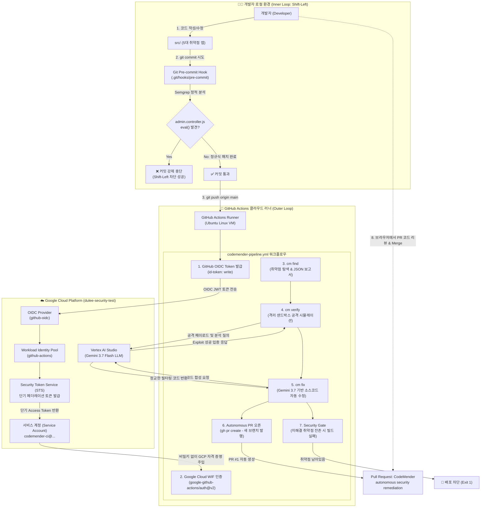
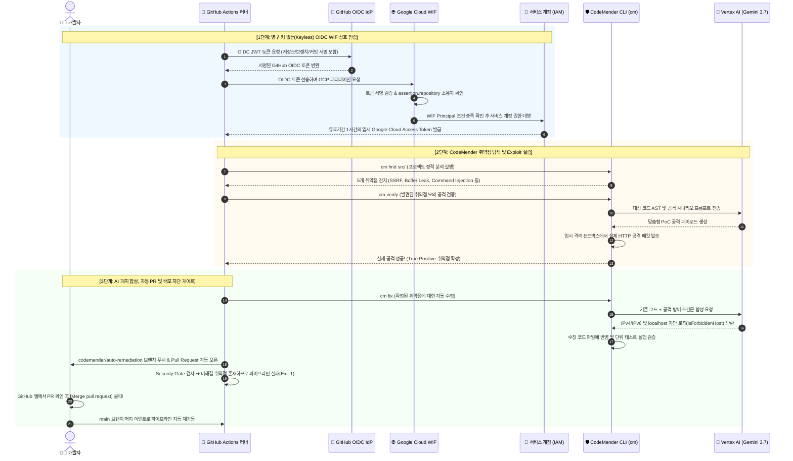

# 🛡️ Enterprise DevSecOps Hands-on Lab: CodeMender & Google Cloud WIF
> **비밀 키 없는(Keyless) GitHub Actions 환경에서 Gemini 3.7 Flash 기반 AI 자율 보안 에이전트를 활용한 취약점 탐지, Exploit 검증, 자동 패치 및 Pull Request 생성 실습**

---

## 📑 목차 (Table of Contents)
1. [랩의 배경 및 해결하고자 하는 과제](#1-랩의-배경-및-해결하고자-하는-과제)
2. [이 랩을 통해 배우는 핵심 개념 4가지](#2-이-랩을-통해-배우는-핵심-개념-4가지)
3. [전체 엔드투엔드 시스템 아키텍처](#3-전체-엔드투엔드-시스템-아키텍처)
4. [보안 인증 및 AI 자율 조치 시퀀스 흐름도](#4-보안-인증-및-ai-자율-조치-시퀀스-흐름도)
5. [실습 대상 애플리케이션 내 5대 보안 취약점 맵](#5-실습-대상-애플리케이션-내-5대-보안-취약점-맵)
6. [사전 준비 사항 (Prerequisites)](#6-사전-준비-사항-prerequisites)
7. [상세 핸즈온 실습 가이드 (Step-by-Step)](#7-상세-핸즈온-실습-가이드-step-by-step)
   - [Step 1: Google Cloud 환경 세팅 및 필수 API 활성화](#step-1-google-cloud-환경-세팅-및-필수-api-활성화)
   - [Step 2: Keyless 인증을 위한 Workload Identity Federation (WIF) 구성](#step-2-keyless-인증을-위한-workload-identity-federation-wif-구성)
   - [Step 3: 전용 서비스 계정(IAM) 생성 및 Vertex AI 권한 부여](#step-3-전용-서비스-계정iam-생성-및-vertex-ai-권한-부여)
   - [Step 4: GitHub 저장소 설정 (Actions 권한 및 Repository Variables)](#step-4-github-저장소-설정-actions-권한-및-repository-variables)
   - [Step 5: 로컬 개발자 Shift-Left 보안 실습 (Inner Loop)](#step-5-로컬-개발자-shift-left-보안-실습-inner-loop)
   - [Step 6: CI/CD 파이프라인 지시서 완성 (Outer Loop)](#step-6-cicd-파이프라인-지시서-완성-outer-loop)
   - [Step 7: 파이프라인 실행, AI 자동 패치 PR 리뷰 및 배포 차단(Gate) 체험](#step-7-파이프라인-실행-ai-자동-패치-pr-리뷰-및-배포-차단gate-체험)
8. [문제 해결 및 트러블슈팅 (FAQ)](#8-문제-해결-및-트러블슈팅-faq)

---

## 1. 랩의 배경 및 해결하고자 하는 과제

전통적인 소프트웨어 개발 및 클라우드 배포 환경에서는 심각한 세 가지 구조적 문제가 존재합니다:

| 기존의 한계점 | 구체적인 위험 및 비효율 | CodeMender & WIF 솔루션의 해결 방식 |
| :--- | :--- | :--- |
| **영구 서비스 계정 키 유출**<br>(Credential Leak) | GitHub Secrets 등에 Google Cloud `JSON Service Account Key`를 등록해 둘 경우, 개발자의 실수로 노출되거나 공격자에 의해 탈취되어 전체 클라우드 인프라가 장악당함. | **Keyless WIF (Workload Identity Federation)**<br>저장된 비밀 키가 전혀 없으며, GitHub Actions가 발행하는 일회성 OIDC 토큰을 GCP STS와 단기 토큰으로 맞교환하여 인증. |
| **정적 분석기(SAST)의 오탐 지옥**<br>(False Positive Fatigue) | 일반적인 보안 스캐너는 의심되는 코드를 모두 경고로 쏟아내어 개발자가 실제 위협인지 일일이 분석하다가 결국 보안 경고 자체를 무시하게 됨. | **Exploit 모의 공격 검증 (`cm verify`)**<br>단순 스캔에 그치지 않고, 가상 환경에서 실제 해킹 페이로드를 주입하여 진짜로 뚫리는 취약점(True Positive)만 필터링. |
| **수동 보안 패치 병목**<br>(Remediation Bottleneck) | 취약점을 발견해도 보안 담당자와 개발자가 미팅을 잡고 코드를 수정하느라 실제 패치까지 수일~수주일이 소요되어 공격자에게 노출됨. | **자율 패치 및 자동 PR (`cm fix`)**<br>Google Cloud Vertex AI(Gemini 3.7 Flash)가 정밀 방어 코드를 스스로 작성하고 단위 테스트 통과 후 **GitHub Pull Request를 자율 생성**. |

---

## 2. 이 랩을 통해 배우는 핵심 개념 4가지

1. **Shift-Left 보안 (Inner Loop)**:
   - 취약점이 원격 Git 저장소로 푸시되기 전, 개발자의 로컬 PC에서 `Git pre-commit hook`과 `Semgrep`을 통해 원격 코드 실행(RCE) 위험을 조기에 차단하는 방법을 배웁니다.
2. **Keyless Google Cloud 인증 (OIDC + WIF)**:
   - Google Cloud IAM과 GitHub Actions가 표준 OIDC(OpenID Connect) 프로토콜을 통해 신뢰 관계를 형성하고, 토큰을 교환하는 원리를 직접 구축합니다.
3. **자율 보안 에이전트 파이프라인 (CodeMender)**:
   - `cm find` (탐색) ➔ `cm verify` (공격 입증) ➔ `cm fix` (패치 합성) ➔ `Autonomous PR` (자동 제안)으로 이어지는 차세대 AI DevSecOps 루프를 경험합니다.
4. **엔터프라이즈 보안 게이트 (Security Gate)**:
   - AI가 PR을 올려주더라도, 사람이 최종 검토하고 머지하기 전까지는 취약점이 존재하는 메인 브랜치의 배포를 강제로 차단(`exit 1`)하는 파이프라인 거버넌스 원리를 이해합니다.

---

## 3. 전체 엔드투엔드 시스템 아키텍처



---

## 4. 보안 인증 및 AI 자율 조치 시퀀스 흐름도



---

## 5. 실습 대상 애플리케이션 내 5대 보안 취약점 맵

`src/` 디렉토리에 고의로 포함된 5가지 실무형 보안 취약점의 상세 정보입니다:

| # | 심각도 | 취약점 유형 (CWE) | 위치 | 공격 시나리오 및 영향 | 해결 주체 |
| :-: | :---: | :--- | :--- | :--- | :---: |
| **1** | **CRITICAL** | **RCE (Remote Code Execution)**<br>`CWE-95` | `src/api/controllers/admin.controller.js` | 사용자 입력 수식을 `eval()`에 직접 전달. 공격자가 서버 셸 명령을 실행하여 서버 완전 장악 가능. | **개발자 로컬 실습**<br>(Shift-Left) |
| **2** | **HIGH** | **SSRF (Server-Side Request Forgery)**<br>`CWE-918` | `src/services/catalog.service.js` | 외부 이미지 URL 프록시 시 IP 검증 누락. 공격자가 `169.254.169.254`(메타데이터) 및 사설망 내부 자원 탈취 가능. | **CodeMender AI**<br>(자동 패치 PR) |
| **3** | **HIGH** | **Memory Information Disclosure**<br>`CWE-200` | `src/services/checkout.service.js` | `Buffer.allocUnsafe()`를 사용해 메모리를 초기화하지 않고 Base64로 전송. 이전 메모리의 암호키/개인정보 노출. | CodeMender 탐지 |
| **4** | **HIGH** | **OS Command Injection**<br>`CWE-78` | `src/services/admin.service.js` | 관리자 핑 진단 기능에서 `opts`를 병합하며 `shell: true` 인젝션 허용. 세미콜론(`;`)으로 임의 명령어 실행. | CodeMender 탐지 |
| **5** | **HIGH** | **Mass Assignment (권한 상승)**<br>`CWE-915` | `src/services/auth.service.js` | 프로필 업데이트 시 필터링 없이 사용자 입력을 복사하여 일반 사용자가 자신의 `role`을 `'admin'`으로 승격 가능. | CodeMender 탐지 |

---

## 6. 사전 준비 사항 (Prerequisites)

1. **Google Cloud 계정**: 활성화된 GCP 프로젝트 (Project Owner 또는 IAM/Vertex AI 수정 권한 필요).
2. **GitHub 계정**: 퍼블릭 또는 프라이빗 리포지토리를 생성할 수 있는 계정.
3. **로컬 개발 도구**:
   - `git` (2.x 이상)
   - `python3` 및 `pip` (Python 3.10 이상)
   - `gcloud` CLI (설치 및 로그인 완료 상태)

---

## 7. 상세 핸즈온 실습 가이드 (Step-by-Step)

### Step 1: Google Cloud 환경 세팅 및 필수 API 활성화
터미널(또는 Cloud Shell)을 열고 사용할 Google Cloud 프로젝트를 설정한 후 실습에 필요한 5대 API를 활성화합니다.

```bash
# 1. 사용할 Google Cloud 프로젝트 ID 지정 (본인의 프로젝트 ID 입력)
export PROJECT_ID="YOUR_GCP_PROJECT_ID"
gcloud config set project $PROJECT_ID

# 2. 프로젝트 번호(Project Number) 확인 및 환경변수 저장
export PROJECT_NUM=$(gcloud projects describe $PROJECT_ID --format='value(projectNumber)')
echo "Project ID: $PROJECT_ID | Project Number: $PROJECT_NUM"

# 3. 필수 API 활성화 (IAM, WIF 토큰 서비스, 리소스 매니저, Vertex AI, 서비스 사용량)
gcloud services enable \
  iam.googleapis.com \
  iamcredentials.googleapis.com \
  cloudresourcemanager.googleapis.com \
  aiplatform.googleapis.com \
  serviceusage.googleapis.com
```

---

### Step 2: Keyless 인증을 위한 Workload Identity Federation (WIF) 구성
GitHub Actions가 사용할 WIF Pool과 Provider를 생성합니다. 이때 Provider의 속성 조건(Condition)을 통해 오직 본인의 GitHub 계정에서 실행되는 워크플로우만 토큰을 교환할 수 있도록 제한합니다.

```bash
# 1. Workload Identity Pool 생성
gcloud iam workload-identity-pools create "github-actions" \
  --project="${PROJECT_ID}" \
  --location="global" \
  --display-name="GitHub Actions Pool"

# 2. OIDC Provider 생성
# ⚠️ 본인의 GitHub 사용자명(Owner)을 지정하세요 (예: ldu1225)
export GITHUB_OWNER="YOUR_GITHUB_USERNAME"

gcloud iam workload-identity-pools providers create-oidc "github-oidc" \
  --project="${PROJECT_ID}" \
  --location="global" \
  --workload-identity-pool="github-actions" \
  --display-name="GitHub Actions OIDC Provider" \
  --issuer-uri="https://token.actions.githubusercontent.com" \
  --attribute-mapping="google.subject=assertion.sub,attribute.repository=assertion.repository" \
  --attribute-condition="assertion.repository_owner == '${GITHUB_OWNER}'"
```

---

### Step 3: 전용 서비스 계정(IAM) 생성 및 Vertex AI 권한 부여
CodeMender 러너가 파이프라인에서 작동할 때 사용할 서비스 계정을 만들고, Gemini 모델을 호출할 수 있는 IAM 역할을 부여한 뒤 WIF와 연결합니다.

```bash
# 1. 서비스 계정 생성
gcloud iam service-accounts create "codemender-ci" \
  --project="${PROJECT_ID}" \
  --display-name="CodeMender CI Service Account"

export SA_EMAIL="codemender-ci@${PROJECT_ID}.iam.gserviceaccount.com"

# 2. 필수 권한 부여
# API 호출 및 할당량 사용 권한
gcloud projects add-iam-policy-binding "${PROJECT_ID}" \
  --member="serviceAccount:${SA_EMAIL}" \
  --role="roles/serviceusage.serviceUsageConsumer"

# Vertex AI Gemini 3.7 Flash 모델 추론 및 세션 생성 권한
gcloud projects add-iam-policy-binding "${PROJECT_ID}" \
  --member="serviceAccount:${SA_EMAIL}" \
  --role="roles/aiplatform.admin"

# 3. WIF Provider와 서비스 계정 바인딩 (해당 저장소의 Actions 러너만 이 서비스 계정으로 전환 가능)
export REPO_NAME="codemender-security-lab"

gcloud iam service-accounts add-iam-policy-binding "${SA_EMAIL}" \
  --project="${PROJECT_ID}" \
  --role="roles/iam.workloadIdentityUser" \
  --member="principalSet://iam.googleapis.com/projects/${PROJECT_NUM}/locations/global/workloadIdentityPools/github-actions/attribute.repository/${GITHUB_OWNER}/${REPO_NAME}"
```

---

### Step 4: GitHub 저장소 설정 (Actions 권한 및 Repository Variables)

#### 1) GitHub Actions Workflow 권한 열기
GitHub 웹 브라우저에서 저장소로 이동하여 설정을 변경합니다:
1. 저장소 상단 메뉴의 **Settings** 클릭
2. 좌측 메뉴에서 **Actions > General** 클릭
3. 페이지 하단의 **Workflow permissions** 섹션으로 이동:
   - [x] **Read and write permissions** 선택
   - [x] **Allow GitHub Actions to create and approve pull requests** 체크박스 활성화
4. **Save** 버튼 클릭

#### 2) Repository Variables 3개 등록하기
비밀 키(Secrets)가 아닌 일반 저장소 변수(Variables)에 WIF 연결 정보를 등록합니다:
1. 좌측 메뉴에서 **Secrets and variables > Actions** 클릭
2. 상단 탭에서 **Variables** (Secrets 아님) 선택
3. **New repository variable** 버튼을 눌러 아래 3개를 차례대로 등록:

| Variable 이름 | 입력할 값의 예시 | 설명 |
| :--- | :--- | :--- |
| `GCP_WIF_PROVIDER` | `projects/1234567890/locations/global/workloadIdentityPools/github-actions/providers/github-oidc` | Step 2에서 만든 WIF Provider의 전체 리소스 경로 |
| `GCP_SA_EMAIL` | `codemender-ci@your-project-id.iam.gserviceaccount.com` | Step 3에서 만든 서비스 계정 이메일 |
| `GCP_QUOTA_PROJECT` | `your-project-id` | API 할당량을 청구할 Google Cloud 프로젝트 ID |

---

### Step 5: 로컬 개발자 Shift-Left 보안 실습 (Inner Loop)

개발자가 코드를 Git에 올리기 전, 로컬 터미널에서 보안 검사를 수행하고 취약점을 직접 수정해 봅니다.

```bash
# 1. Semgrep 정적 분석 도구 설치
pip install semgrep

# 2. 로컬 Git Pre-commit 훅 활성화 (install.sh 실행)
./lab/hooks/install.sh
# -> .git/hooks/pre-commit 파일이 설치되어 커밋 시마다 자동 실행됩니다.

# 3. [체험] 취약한 상태 그대로 커밋 시도해보기
git add src/api/controllers/admin.controller.js
git commit -m "test: commit vulnerable eval"
# 🛑 결과: Pre-commit 훅이 eval() 사용을 감지하고 커밋을 강제로 차단(Abort)합니다!
```

#### 🛠️ 취약점 수정 실습:
`src/api/controllers/admin.controller.js` 파일을 열고, 위험한 `eval()` 대신 정규식 기반 검증 로직으로 수정합니다:

```javascript
// src/api/controllers/admin.controller.js

const adminService = require('../../services/admin.service');

exports.checkShippingStatus = (req, res) => {
    adminService.pingProvider(req.body.providerIP, req.body.options, out => res.send(out));
};

// ✅ 안전한 수식 검증 헬퍼 함수 추가
function safeCalculate(formula) {
    if (typeof formula !== 'string' || !/^[0-9+\-*/().\s]+$/.test(formula)) {
        throw new Error("Invalid formula expression");
    }
    return Function(`'use strict'; return (${formula})`)();
}

exports.previewDynamicPricing = (req, res) => {
    try {
        // ✅ eval()을 제거하고 safeCalculate()로 대체
        res.json({ price: safeCalculate(req.body.formula) });
    } catch (e) {
        res.status(400).send("Evaluation Failed");
    }
};
```

수정 후 다시 커밋하고 푸시합니다:
```bash
git add src/api/controllers/admin.controller.js
git commit -m "fix(security): sanitize dynamic eval in admin.controller.js"
git push origin main
# ✅ Semgrep 검사를 통과하여 원격 main 브랜치에 정상 커밋됩니다!
```

---

### Step 6: CI/CD 파이프라인 지시서 완성 (Outer Loop)

이제 GitHub Actions가 푸시를 감지하고 CodeMender를 작동시킬 수 있도록 워크플로우 YAML 파일을 완성합니다.

```bash
# 1. workflows 폴더 생성 및 템플릿 복사
mkdir -p .github/workflows
cp lab/templates/codemender-pipeline.template.yaml .github/workflows/codemender-pipeline.yml
```

`.github/workflows/codemender-pipeline.yml` 파일을 에디터로 열어 **3곳의 FIXME** 주석을 찾아 채워 넣습니다:

1. **FIXME 1 (WIF OIDC 토큰 권한 부여)**:
   ```yaml
   permissions:
     contents: write
     pull-requests: write
     id-token: write      # <-- FIXME 1: WIF 토큰 발급에 필수적인 권한
   ```
2. **FIXME 2 (CodeMender 스캔 명령어)**:
   ```yaml
   # FIXME 2: 취약점 스캔 명령어 작성
   cm find "$SCAN_PATH" -y --model "$CM_MODEL" 2>&1 | tee "$RUNNER_TEMP/scan.cm.log" || true
   ```
3. **FIXME 3 (CodeMender 자동 패치 명령어)**:
   ```yaml
   # FIXME 3: Gemini 기반 자동 패치 명령어 작성
   cm fix "$FID" -y --bypass-warning --model "$CM_MODEL" 2>&1 | tee "$RUNNER_TEMP/fix-$FID.cm.log" || true
   ```
*(※ 작성 내용이 헷갈리신다면 `lab/solutions/codemender-pipeline.solution.yaml` 완성본 파일을 참고하세요)*

완성된 파이프라인을 커밋하고 푸시합니다:
```bash
git add .github/workflows/codemender-pipeline.yml
git commit -m "ci: activate codemender autonomous security pipeline"
git push origin main
```

---

### Step 7: 파이프라인 실행, AI 자동 패치 PR 리뷰 및 배포 차단(Gate) 체험

#### 1) GitHub Actions 실행 관찰
GitHub 저장소 상단의 **Actions** 탭으로 이동합니다. 방금 푸시한 커밋으로 인해 **CodeMender CI/CD Guardrail** 워크플로우가 실행 중인 것을 볼 수 있습니다.
- `Authenticate to Google Cloud (WIF / ADC)`: 비밀 키 없이 OIDC 토큰으로 GCP에 로그인 성공.
- `CodeMender Scan`: 소스코드를 분석하여 SSRF 등 잔여 취약점 4건 탐지.
- `Verify and Remediate`:
  - `cm verify`: 실제 모의 해킹을 통해 SSRF 공격 성공 입증.
  - `cm fix`: Gemini 3.7 Flash 모델이 사설 IP 차단 방어 코드를 실시간 생성하여 패치 적용.
- `Open Remediation Pull Request`: 수정된 코드로 새 브랜치를 만들어 GitHub PR 자동 발행.

#### 2) 자율 생성된 Pull Request 확인
저장소의 **Pull requests** 탭으로 이동하면 CodeMender가 생성한 신규 PR이 열려 있습니다:
- **PR 제목**: `CodeMender: autonomous security remediation`
- **Files changed**: `src/services/catalog.service.js` 파일에 IPv4/IPv6, localhost, 내부망 주소를 모두 차단하는 완벽한 `isForbiddenHost()` 함수가 추가된 것을 확인할 수 있습니다!

#### 3) Security Gate의 배포 차단(Failure) 확인
Actions 실행 결과 화면에서 워크플로우 맨 마지막 단계인 **`Security Gate`**가 **빨간색(Failure, Exit 1)**으로 끝난 것을 확인합니다:
> *"CodeMender found 4 HIGH/CRITICAL finding(s). 1 proposed for remediation in the pull request... Failing the pipeline."*

💡 **이것이 바로 DevSecOps의 핵심 원칙입니다!**  
AI가 자동 패치 PR을 올려두었더라도, 개발자가 검토하고 머지하기 전까지는 보안 취약점이 남아있는 메인 브랜치의 운영 서버 배포를 원천 차단하는 것입니다.

#### 4) PR 머지 및 파이프라인 재가동
1. 열려 있는 Pull Request 페이지에서 **[Merge pull request]** ➔ **[Confirm merge]**를 클릭합니다.
2. 머지되는 즉시 GitHub Actions가 자동으로 다시 트리거되어 실행되는 것을 확인합니다.
3. 방금 머지한 패치 코드가 검증되고 해결되었음을 시스템이 인지하는 완전한 선순환 수명주기를 체험합니다.

---

## 8. 문제 해결 및 트러블슈팅 (FAQ)

### Q1. WIF 인증 단계에서 `403 Forbidden` 또는 `Subject token invalid` 에러가 발생합니다.
- **원인**: WIF Provider 설정 시 지정한 `attribute-condition`과 실제 푸시한 저장소의 소유자(Owner) 이름이 일치하지 않을 때 발생합니다.
- **해결책**:
  ```bash
  gcloud iam workload-identity-pools providers describe "github-oidc" \
    --project="${PROJECT_ID}" \
    --location="global" \
    --workload-identity-pool="github-actions" \
    --format="value(attributeCondition)"
  ```
  위 명령어로 조건이 본인의 GitHub 사용자명(`assertion.repository_owner == 'your-username'`)과 일치하는지 확인하세요.

### Q2. `cm verify` 또는 `cm fix` 단계에서 `aiplatform.endpoints.predict` 권한 부족 에러가 납니다.
- **원인**: 서비스 계정에 부여된 Vertex AI 권한이 부족하여 Gemini 3.7 모델 엔드포인트와 통신하지 못한 경우입니다.
- **해결책**: Step 3의 명령어를 재실행하여 서비스 계정에 `roles/aiplatform.admin` 권한을 부여하세요.
  ```bash
  gcloud projects add-iam-policy-binding "${PROJECT_ID}" \
    --member="serviceAccount:${SA_EMAIL}" \
    --role="roles/aiplatform.admin"
  ```

### Q3. 파이프라인에서 `gh pr create` 단계가 권한 오류(`Resource not accessible by integration`)로 실패합니다.
- **원인**: GitHub 저장소의 Actions Workflow 권한이 `Read-only`로 제한되어 있어 PR을 생성하지 못한 경우입니다.
- **해결책**: Step 4의 **GitHub 저장소 권한 설정**을 다시 확인하고, **Read and write permissions** 및 **Allow GitHub Actions to create and approve pull requests** 체크박스를 반드시 활성화하세요.
